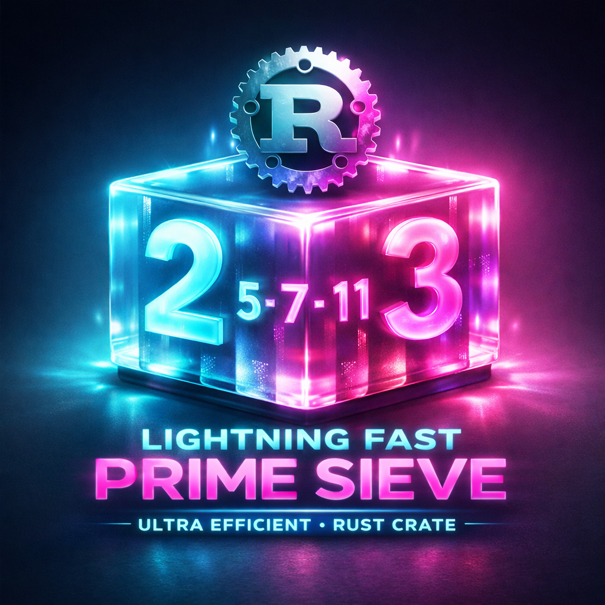
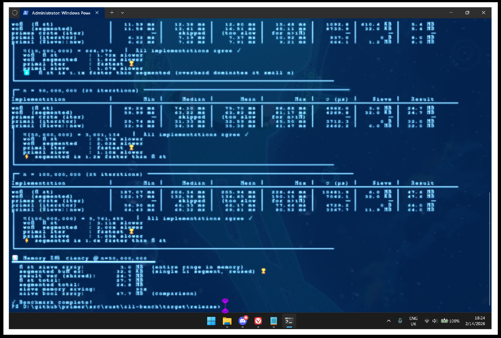

# PRIMER - AN IMPROVED RUST PRIMES CRATE


<p align="center">
  
  
  
  
  <a href="https://github.com/whisprer/primer/blob/main/LICENSE">
    
  </a>
</p>

<p align="center">
  <a href="https://github.com/whisprer/primer">
    
  </a>
</p>

<p align="center">
  <a href="https://github.com/whisprer/primer">
    
  </a>
  <a href="https://github.com/whisprer/primer/issues">
    
  </a>
  <a href="https://github.com/whisprer/primer/fork">
    
  </a>
</p>

# ** PRIMER **


## A Bit-Packed Prime Sieve - Rust Port

Ultra-efficient Sieve of Eratosthenes with 64x memory reduction, hardware intrinsics, and C++ performance.


## Quick Start

```bash
# Compile with maximum optimizations
rustc -C opt-level=3 -C target-cpu=native primer.rs

# Run
./primer
```

**Expected output:**
```
Bit-Packed Sieve of Eratosthenes

Generated 41538 primes up to 500000
Time: ~1-3ms
Memory: 4000 bytes (bit-packed)

First 10 primes: [2, 3, 5, 7, 11, 13, 17, 19, 23, 29]
Last 10 primes: [499883, 499897, 499903, 499927, 499943, 499957, 499969, 499973, 499979, 499999]

✓ All assertions passed!
```


## What's Included

| File | Description |
|------|-------------|
| `primer.rs` | Production-ready Rust implementation |
| `PERFORMANCE_ANALYSIS.md` | Benchmarks, scaling, use cases |
| `SIDE_BY_SIDE.md` | C++ → Rust translation guide |
| `BORROW_CHECKER_FIX.md` | How we fixed the compile errors |


## Key Features

- **64x Memory Reduction**: 1 bit per odd number vs 8+ bytes naive
- **Hardware Intrinsics**: `trailing_zeros()` compiles to `tzcnt` instruction
- **Brian Kernighan Bit Iteration**: Skips zero bits entirely
- **Odd-Only Sieving**: Hardcode 2, process only odd candidates
- **Cache Friendly**: Sequential bit scanning


## Performance vs Alternatives

| Method | n=500k | Memory | Speed | Use Case |
|--------|--------|--------|-------|----------|
| **This (bit-packed)** | 41,538 primes | **4 KB** | **~2ms** | Bulk generation |
| Rust `primes` crate | 41,538 primes | ~500 KB | ~15ms | Lazy iteration |
| Rust `primal` crate | 41,538 primes | ~50 KB | ~3ms | Cache-friendly sieve |


<p align="center">
  
</p>


## Usage Examples

### Basic Usage
```rust
use primer::sieve_primes;

fn main() {
    let primes = sieve_primes(1000);
    println!("Found {} primes", primes.len()); // 168
}
```

### Distributed Network Integration
```rust
// Generate prime table at boot for distributed node IDs
const PRIME_LIMIT: u64 = 10_000;
static PRIMES: once_cell::sync::Lazy<Vec<u64>> = 
    once_cell::sync::Lazy::new(|| sieve_primes(PRIME_LIMIT));

// GPS coordinate hashing
fn hash_location(lat: f64, lon: f64) -> u64 {
    let idx = ((lat + lon).abs() as usize) % PRIMES.len();
    PRIMES[idx]
}

// MQTT topic partitioning
fn assign_topic(node_id: u64, n_topics: usize) -> usize {
    let prime = PRIMES[n_topics];
    (node_id % prime) as usize
}
```

### ESP32 Embedded Use
```rust
// Generate small prime table for memory-constrained device
const ESP32_PRIMES: &[u64] = &{
    const LIMIT: u64 = 1000;
    // Generate at compile time with const_primes crate, or
    // Generate once at startup (< 100µs, ~16 bytes)
};
```

## Optimizations Explained

### 1. Bit Packing
```rust
// Instead of: Vec<bool> (8+ bytes per number)
// We use: Vec<u64> with 1 bit per odd number

let mut b = vec![!0u64; ((n/2) >> 6) + 1];
//                └─ all bits set to 1 (assume prime)
//                        └─ divide by 64 (bits per u64)
```

### 2. Odd-Only Sieving
```rust
// Number `n` maps to bit index: (n - 1) / 2
// Bit index `i` maps to number: (i * 2) + 1

let h = n / 2; // Only process odd numbers
let mut r = vec![2]; // Hardcode the only even prime
```

### 3. Hardware Intrinsics
```rust
// C++: __builtin_ctzll(w)
// Rust: w.trailing_zeros()
// Both compile to: tzcnt instruction on x86_64

let tz = w.trailing_zeros(); // Find position of lowest set bit
```

### 4. Brian Kernighan Bit Trick
```rust
while w != 0 {
    // Extract position of lowest set bit
    let pos = w.trailing_zeros();
    
    // Clear lowest set bit (skip to next)
    w &= w - 1;
}
// Iterates ONLY over set bits, not all 64!
```


## Testing

```bash
# Run built-in tests
rustc --test primer.rs -o test_primer
./test_primer
```

**Test coverage:**
- Small prime sets (n=10, 20, 100)
- Known prime counts (π(100)=25, π(1000)=168)
- Edge cases (n=0, 1, 2, 3)
- Compact vs standard implementation equality


## Scaling Behavior

| n | Primes | Memory | Time (est) |
|---|--------|--------|------------|
| 1K | 168 | 8 B | <1 µs |
| 10K | 1,229 | 80 B | ~5 µs |
| 100K | 9,592 | 800 B | ~50 µs |
| 1M | 78,498 | 8 KB | ~1 ms |
| 10M | 664,579 | 80 KB | ~15 ms |
| 100M | 5.76M | 800 KB | ~200 ms |


## Troubleshooting

### Compile Error: "cannot borrow `b` as mutable..."
This was fixed in the updated version. The issue was trying to use iterators while mutating the same array. See `BORROW_CHECKER_FIX.md` for details.

### Warning: "unused variable `prime`"
Also fixed. We removed the intermediate variable that wasn't being used.

### Slow Performance
Make sure you're compiling with optimizations:
```bash
rustc -C opt-level=3 -C target-cpu=native primer.rs
```

Without `-C opt-level=3`, performance will be 10-100x slower!

## Learn More

- **PERFORMANCE_ANALYSIS.md**: Deep dive into benchmarks and use cases
- **SIDE_BY_SIDE.md**: Line-by-line C++ → Rust translation
- **BORROW_CHECKER_FIX.md**: Understanding and fixing Rust borrow errors

## Integration Patterns

### As a Library
```rust
// In your Cargo.toml
[dependencies]
# Copy primer.rs into your project as a module

// In your code
mod primer;
use primer::sieve_primes;
```

### Precomputed Table
```rust
// Generate once, use many times
lazy_static! {
    static ref PRIMES: Vec<u64> = sieve_primes(1_000_000);
}

fn is_prime_lookup(n: u64) -> bool {
    PRIMES.binary_search(&n).is_ok()
}
```

### Iterator Wrapper
```rust
pub struct PrimeIter {
    primes: Vec<u64>,
    index: usize,
}

impl Iterator for PrimeIter {
    type Item = u64;
    
    fn next(&mut self) -> Option<u64> {
        if self.index < self.primes.len() {
            let p = self.primes[self.index];
            self.index += 1;
            Some(p)
        } else {
            None
        }
    }
}
```

## License

Same as original C++ implementation - Hybrid MIT & CC0 - use Freely!


## Credits

- Original C++ bit-packed implementation whisprer
- Ported to Rust with borrow checker compliance whisprer & ClaudeOpus4.6
- Optimized for distributed timing networks
- Inspired by the insane single midnedness of RTC.
- RIP CLaude/Gemini/ChatGPT. Long Live ClaudeOpus4.6/Gemini3.0Pro/ChatGPT5.2!

---

**Perfect for:**
- GPS coordinate hashing
- Rubidium frequency calibration tables  
- MQTT topic distribution
- ESP32/embedded prime generation
- Any scenario where memory efficiency matters


**Compile it. Run it. Ship it.**
